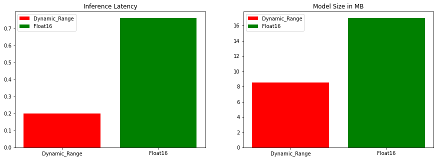
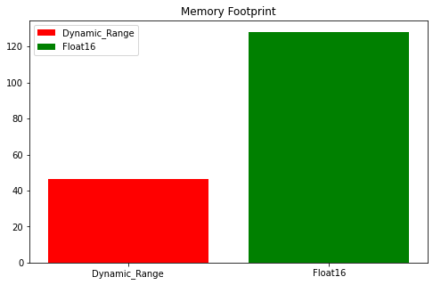

# Converting Opensourced OCR Models to TFLite

This repository is to create tflite models for the available ocr models.

### TFLite Models Available

- [Captcha OCR](https://keras.io/examples/vision/captcha_ocr/)
- [Keras OCR](https://github.com/faustomorales/keras-ocr)

**Note: Currently Keras OCR doesn't support Integer Quantization as of now and already reported to TFLite team.**

### TFLite Models On Progress (Stay Tuned)

- [EasyOCR](https://github.com/JaidedAI/EasyOCR)

### About the files
 ```
 ├── colabs
     ├── KERAS_OCR_TFLITE.ipynb       --> Code for Convert Keras OCR model to TFLite and doing inference.
     ├── captcha_ocr_tflite.ipynb     --> Code to Convert Keras Captcha OCR to TFLite and code to do inference.
     ├── captcha_ocr_inference.ipynb  --> Inference code for captcha OCR.
     ├── ENDTOEND_OCR_TFLITE.ipynb    --> End to End OCR with CRAFT,EAST as text detector and KERAS OCR as Recognition Engine.

 ├── models
     ├──  ocr_dr.tflite                --> Captcha OCR TFLite model.
     ├──  keras_ocr_dr.tflite          --> Keras OCR Dynamic Range Quantized TFLite Model
     ├──  keras_ocr_float16.tflite     --> Keras OCR Float16 Quantized TFLite Model
 ├── images
     Contains sample input images used for inference.
 ├── data
     Contains representative dataset used while converting to TFLite using Integer Quantization.
 ```
 
### Benchmarks

**KERAS OCR**


<p align="center">

 </p>
 
                                           All the above benchmarks are w.r.t Redmi K20 Pro
 
### Tensorflow Hub

Keras OCR Models are published in [TensorFlow Hub](https://tfhub.dev/tulasiram58827/lite-model/keras-ocr/dr/1)

You can find this [repo](https://github.com/tulasiram58827/craft_tflite) for converting CRAFT models to TFLite and using them for inference. For more details please find these blogs on Text Detectors.

- [Converting CRAFT to TFLite: A Guide to PyTorch-TFLite Conversion](https://tulasi.dev/craft-in-tflite)
- [A Battle of Text Detectors for Mobile Deployments: CRAFT vs. EAST](https://sayak.dev/optimizing-text-detectors/)


Feel free to suggest any other models through issues or contribute through Pull Requests.
